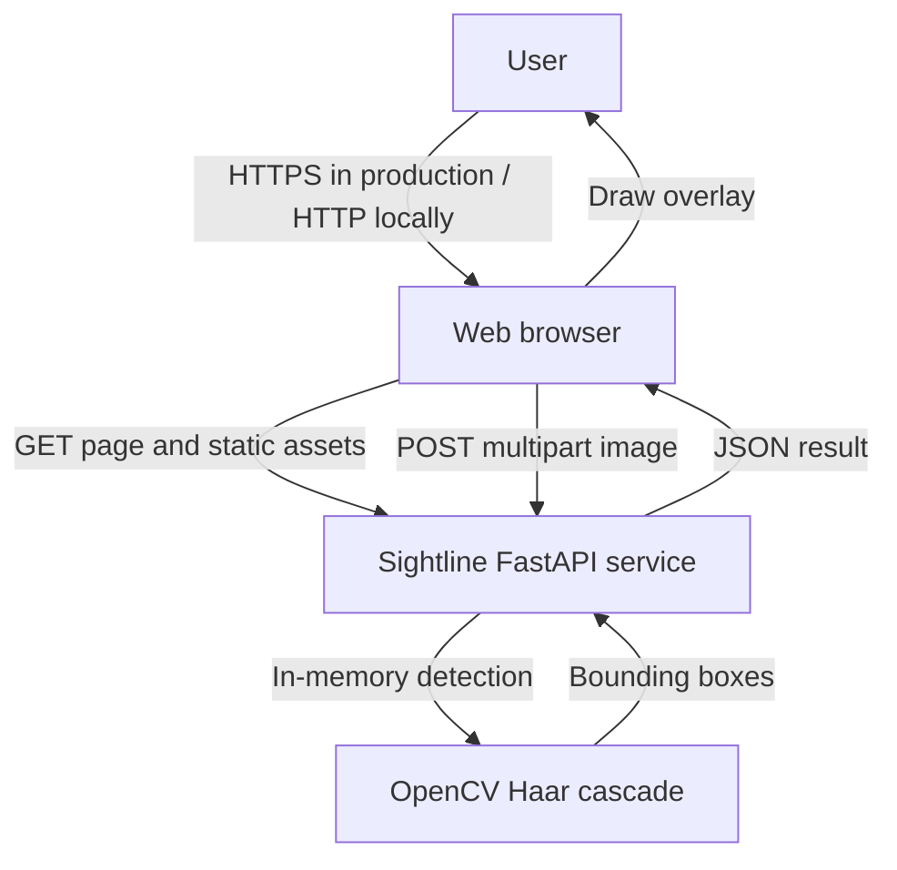
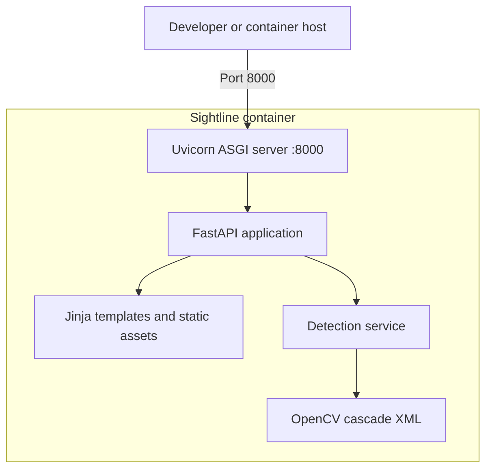
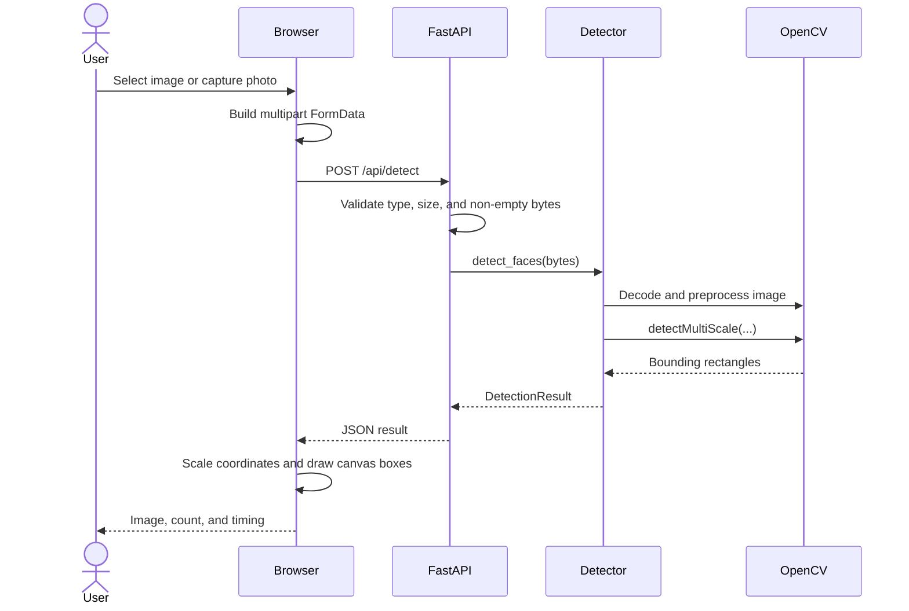
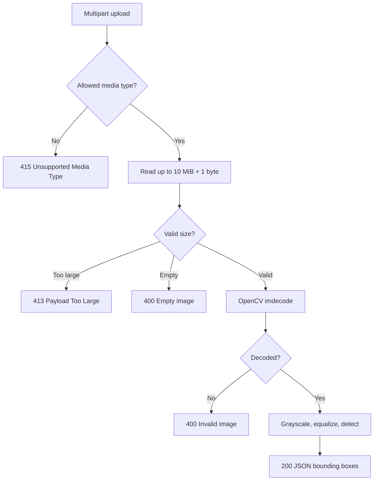
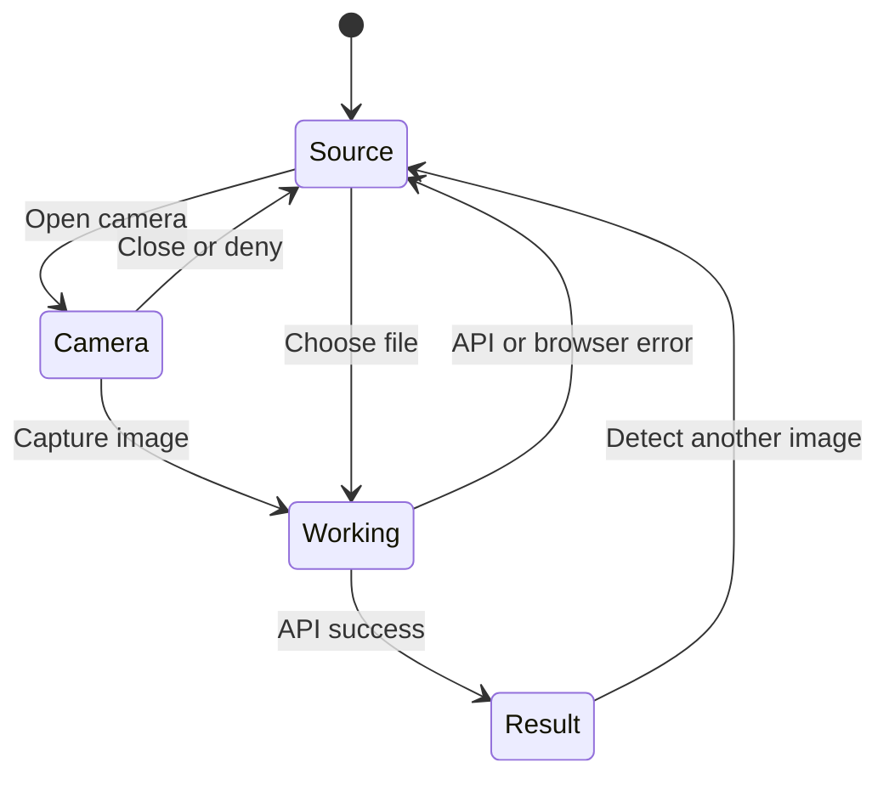
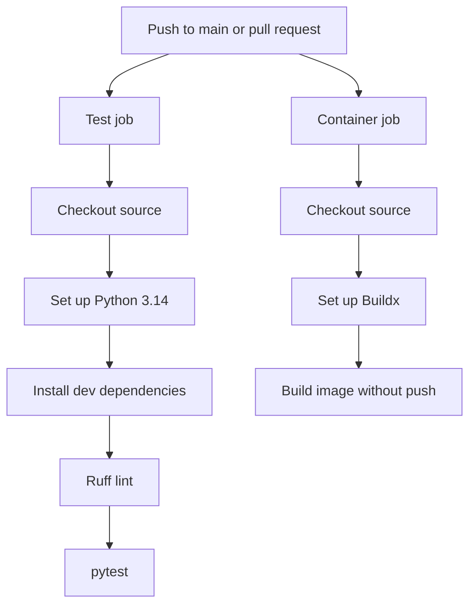

# Sightline architecture

## 1. Architectural style

Sightline uses a stateless, layered monolith. The browser-facing UI, HTTP API, and computer-vision service are packaged together and run in one Uvicorn/FastAPI process. There are no external data services in the current architecture.

## 2. System context

The diagram intentionally contains no database or object store because none exists in the implementation.

## 3. Container and runtime view

The cascade XML is installed inside the Python environment by the OpenCV package. `get_classifier()` resolves it through `cv2.data.haarcascades` and caches the loaded classifier for the process lifetime.

## 4. Component responsibilities

| Component | File | Main responsibility |
|---|---|---|
| FastAPI app | `app/main.py` | Creates the app, mounts static assets, renders the page, validates uploads, maps domain errors to HTTP responses, and exposes health |
| Detector | `app/detector.py` | Decodes bytes, preprocesses pixels, loads/caches the classifier, runs detection, and creates typed results |
| HTML template | `app/templates/index.html` | Defines upload, camera, processing, result, trust, and footer views |
| Browser controller | `app/static/app.js` | Controls UI states, camera access, multipart submission, response handling, preview URLs, and canvas drawing |
| Styles | `app/static/styles.css` | Layout, visual states, dialogs, result display, and responsive behavior |
| Uvicorn | Container command/local CLI | Hosts the ASGI application and handles HTTP connections |
| Docker image | `Dockerfile` | Builds a non-root Python runtime containing the app and dependencies |
| Compose service | `docker-compose.yml` | Builds/runs the container, publishes port 8000, restarts it, and checks health |
| CI workflow | `.github/workflows/ci.yml` | Runs source validation and verifies the Docker image builds |

## 5. Upload-to-result sequence

## 6. Backend processing pipeline

## 7. Detection internals

1. `np.frombuffer` exposes the request bytes as an unsigned 8-bit array.
2. `cv2.imdecode` creates a BGR image matrix.
3. `cv2.cvtColor` converts BGR pixels to grayscale.
4. `cv2.equalizeHist` improves grayscale contrast.
5. `CascadeClassifier.detectMultiScale` searches at multiple scales.
6. Each `(x, y, width, height)` tuple becomes an immutable `Face` dataclass.
7. `DetectionResult.as_dict()` creates the JSON-compatible response.

The classifier parameters trade accuracy and performance:

- `scaleFactor=1.1`: image scale decreases by 10% between passes; smaller steps may find more faces but cost more CPU.
- `minNeighbors=5`: a candidate needs supporting detections; higher values generally reduce false positives but may miss faces.
- `minSize=(40, 40)`: candidates smaller than 40 × 40 pixels are ignored.

## 8. Browser state model

The browser does not receive a server-rendered result page. It stays on the same page, calls the API with `fetch`, and changes UI states client-side.

## 9. CI architecture

The two jobs run independently. Passing CI means source checks and image construction succeeded; it does not mean the application was deployed.

## 10. Key design decisions

### Stateless processing

No image history is stored. This minimizes persistence, simplifies scaling, and avoids database operations. It also means there is no audit history or user-visible past activity.

### One service

UI, API, and detection share one deployable unit. This keeps local development simple. At larger scale, CPU-heavy detection may be separated into workers or a dedicated inference service.

### Server-side detection, client-side drawing

The server only returns coordinates; the browser keeps and displays its own image preview. This avoids returning or re-encoding the uploaded image from the server.

### Cached classifier

`@lru_cache(maxsize=1)` prevents loading the cascade on every request. The cache is local to each process; multiple Uvicorn workers each load their own classifier.

### Non-root container

The image creates UID `10001` and switches to the `sightline` user. This limits damage if the application is compromised, although additional filesystem and Linux-capability restrictions are recommended in production.

## 11. Scaling path

A future production architecture could place a TLS-terminating load balancer in front of multiple stateless app replicas. CPU and memory limits, rate limiting, request-size enforcement at the edge, metrics, structured logs, and autoscaling would then be necessary. A queue/worker architecture is only needed if asynchronous jobs or heavier models are introduced; it is not part of the present system.

