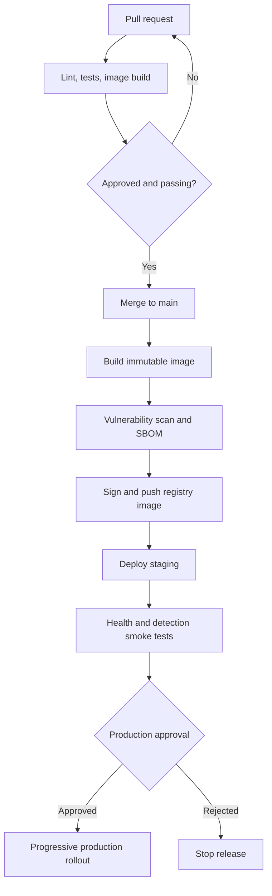

# DevOps and operations guide

## 1. Current delivery model

Sightline follows a simple source-to-container workflow:

1. A developer changes code in Git.
2. A pull request triggers GitHub Actions.
3. CI installs Python dependencies, runs Ruff, and runs pytest.
4. A separate CI job verifies that the Docker image builds.
5. A maintainer reviews and merges the change.
6. Deployment is currently manual and not implemented in this repository.

## 2. Docker image

The Dockerfile performs these steps:

1. Starts from `python:3.14-slim`.
2. Prevents `.pyc` creation and enables unbuffered output.
3. Sets `/app` as the working directory.
4. Copies package metadata and application source.
5. Installs runtime dependencies without retaining pip's cache.
6. Creates an unprivileged `sightline` user with UID 10001.
7. Switches from root to that user.
8. documents port 8000.
9. starts Uvicorn on all container interfaces.

### Build and inspect

```bash
docker build -t sightline:local .
docker image inspect sightline:local
```

### Run directly

```bash
docker run --rm -p 8000:8000 --name sightline sightline:local
```

### Validate the running container

```bash
curl http://localhost:8000/health
curl http://localhost:8000/docs
```

## 3. Docker Compose

The Compose service:

- builds from the repository root;
- maps host port 8000 to container port 8000;
- restarts unless explicitly stopped;
- calls `/health` every 30 seconds;
- waits up to 5 seconds per health check;
- marks the service unhealthy after three failures.

```bash
docker compose up --build -d
docker compose ps
docker compose logs -f sightline
```

The current Compose file defines no volumes, secrets, networks, CPU limits, memory limits, or replicas.

## 4. CI/CD workflow

Workflow file: `.github/workflows/ci.yml`.

### Triggers

- Every pull request.
- Pushes to `main`.

### Permissions

`contents: read` follows least privilege for the current read-only validation workflow.

### Test job

| Step | Purpose |
|---|---|
| Checkout | Makes repository contents available to the runner |
| Python setup | Installs Python 3.14 and enables pip caching |
| Install | Installs runtime and `dev` dependencies in editable mode |
| Ruff | Rejects configured lint violations |
| pytest | Runs the automated test suite |

### Container job

| Step | Purpose |
|---|---|
| Checkout | Makes build context available |
| Buildx setup | Provides Docker BuildKit capabilities |
| Build | Verifies the image can be constructed |

`push: false` means no image is uploaded. The tag `sightline:test` exists only in the build job's context.

## 5. Branch protection recommendations

For a team repository, configure `main` to require:

- pull requests instead of direct pushes;
- at least one approval;
- passing `test` and `container` checks;
- resolved review conversations;
- no force pushes or branch deletion;
- CODEOWNERS review for workflow and deployment files where appropriate.

These are GitHub repository settings, not files currently enforced by this project.

## 6. Production-readiness gap analysis

| Area | Current state | Recommended production control |
|---|---|---|
| Deployment | Not defined | Add environment-specific automated deployment with approval gates |
| Image publishing | Build only | Push immutable SHA tags to a registry |
| Supply chain | No SBOM/signing | Generate SBOM, scan, and sign images |
| Dependencies | Version ranges | Use a repeatable lock/constraint process and automated updates |
| TLS | Not defined | Terminate HTTPS at a trusted ingress/load balancer |
| Secrets | None needed now | Use platform secret storage if future integrations require secrets |
| Scaling | One process/container | Load test, set limits, and select workers/replicas based on CPU |
| Rate limits | None | Apply edge and/or application rate limiting |
| Observability | Default Uvicorn logs | Add structured logs, metrics, dashboards, and alerts |
| Resilience | Compose restart only | Add orchestration probes, rollout policy, and multiple replicas |
| Security headers | Not configured | Add CSP, HSTS under HTTPS, MIME protections, and frame policy |
| CORS | Default same-origin use | Define explicit origins only if a separate frontend is introduced |
| Privacy | No intentional storage | Validate proxy logs, dumps, telemetry, retention, and legal requirements |

## 7. Recommended release pipeline



Use the Git commit SHA as the immutable image tag. A human-friendly version tag can point to the same digest, but deployments should record the digest for rollback and auditability.

## 8. Runtime configuration recommendations

Before production deployment, make these settings configurable and validated:

- Host/port and Uvicorn worker count.
- Log format and level.
- Upload size limit.
- Allowed media types.
- Detection parameters.
- Trusted proxy/forwarded-header behavior.
- Allowed origins, if cross-origin use is required.
- Request timeout and maximum concurrency.

Never accept arbitrary classifier paths or unsafe OpenCV inputs from untrusted environment values without validation.

## 9. Security controls

### Already present

- Non-root container user.
- Read-only GitHub Actions contents permission.
- Bounded upload read.
- Media-type allowlist followed by actual image decoding.
- No intentional server-side image persistence.
- Minimal slim runtime base.

### Recommended next steps

- Pin the base image by digest and define an update cadence.
- Scan dependencies and images in CI.
- Add a read-only root filesystem where the platform permits it.
- Drop Linux capabilities and prevent privilege escalation.
- Set CPU, memory, process, and request limits.
- Reject decompression-bomb-style images by validating decoded pixel dimensions.
- Add rate limiting and upstream body-size enforcement.
- Add security headers and HTTPS.
- Avoid logging request bodies, filenames, or personal data.
- Review third-party font requests; self-host fonts if the privacy claim requires no external browser requests.

## 10. Observability plan

### Logs

Prefer structured JSON logs containing:

- timestamp;
- severity;
- request/correlation ID;
- route and method;
- status code;
- duration;
- image byte size and dimensions, if policy permits;
- detected face count, only if appropriate for the privacy policy;
- error category without source image content.

Do not log raw images, multipart bodies, biometric-like data, or sensitive client details unnecessarily.

### Metrics

Recommended service-level metrics:

- request rate by route/status;
- p50, p95, and p99 latency;
- detection processing time;
- upload rejection count by reason;
- in-flight requests;
- process CPU and memory;
- container restarts;
- health-check failures.

### Initial service objectives

Define objectives after load testing. Example categories—not commitments—include availability, successful-request latency, and error rate. Thresholds should reflect the chosen host size, image limits, and expected traffic.

## 11. Health, readiness, and liveness

The existing `/health` endpoint loads or retrieves the cached classifier and returns:

```json
{"status":"healthy","model":"ready"}
```

If classifier loading raises `RuntimeError`, it returns degraded JSON but still uses HTTP `200`. This works for the current Compose command because it only checks whether the URL opens. A production orchestrator may need separate endpoints:

- **Liveness:** process/event loop is responsive.
- **Readiness:** classifier is loaded and the replica can accept work.
- **Startup:** allows sufficient time for initialization.

Readiness should return a non-2xx status when the replica must not receive traffic.

## 12. Capacity considerations

Each request holds compressed bytes plus a decoded pixel matrix and grayscale copy in memory. A small compressed file can decode to a large image, so the 10 MiB upload cap is not a complete memory limit. Add maximum decoded width, height, and pixel-count checks.

Detection is CPU-bound. Benchmark representative images before choosing:

- Uvicorn worker count;
- container CPU/memory requests and limits;
- replica count;
- maximum concurrency;
- autoscaling signals.

Increasing workers also duplicates the classifier and Python process memory.

## 13. Backup and disaster recovery

The application has no persistent application data, so there is no database or upload volume to back up. Recovery assets are:

- Git repository and protected history;
- container images in a registry, once publishing is added;
- infrastructure/deployment configuration;
- registry retention and signing records;
- operational dashboards and alert configuration.

Rollback should redeploy a previously verified image digest. If deployments later add state, create a separate backup and restore plan for that state.

## 14. Operational runbooks

### Service unavailable

1. Check container/orchestrator status.
2. Read recent application and platform logs.
3. Call `/health` from inside and outside the service network.
4. Confirm port, ingress, and DNS configuration.
5. Check CPU, memory, restart count, and disk pressure.
6. Roll back to the last healthy image if the incident follows a release.

### Health is degraded

1. Inspect the classifier-loading error in application logs.
2. Confirm the OpenCV package and cascade XML exist in the image.
3. Compare the deployed image digest with the approved release.
4. Reproduce with the same image locally or in staging.
5. Remove the replica from traffic or roll back.

### Detection latency increases

1. Compare request rate and image dimensions with the baseline.
2. Check CPU throttling, memory pressure, and concurrency.
3. Identify unusually large decoded images.
4. Scale replicas or reduce admitted concurrency.
5. Add/adjust decoded-pixel limits based on measured safe values.

### Error rate increases

1. Break down failures by HTTP status and route.
2. Separate expected client rejections (`400`, `413`, `415`) from server failures (`5xx`).
3. Correlate the start time with releases or traffic changes.
4. Reproduce a sanitized failing request in staging.
5. Roll back if the current release caused the regression.

## 15. Deployment checklist

Before every production release:

- [ ] Required reviews and CI checks passed.
- [ ] Image built from the intended commit and tagged immutably.
- [ ] Dependency and image scans reviewed.
- [ ] SBOM generated and image signature verified.
- [ ] Configuration changes reviewed separately from code.
- [ ] Staging health and detection smoke tests passed.
- [ ] Capacity and error dashboards are visible.
- [ ] Rollback image/digest is known.
- [ ] Progressive rollout and rollback thresholds are defined.
- [ ] Post-deployment health, latency, and error rate are checked.

